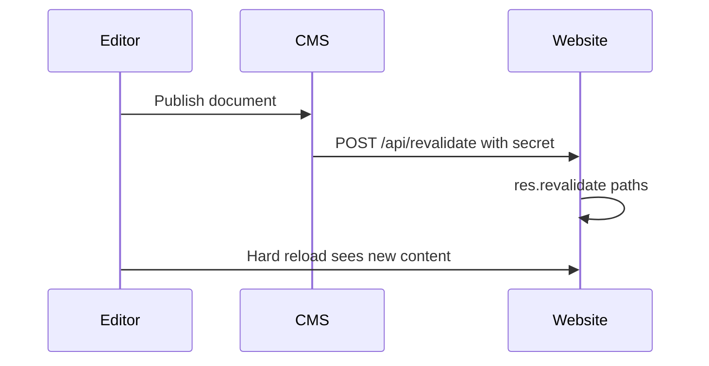

# B-Side website and CMS roadmap

Work for [bside-ms/bside_website](https://github.com/bside-ms/bside_website) and [bside-ms/bside_payload](https://github.com/bside-ms/bside_payload). Implement in small PRs, not as one change. Check a box when the PR is merged and live.

Architecture context: [AGENTS.md](./AGENTS.md) here and [AGENTS.md](https://github.com/bside-ms/bside_payload/blob/main/AGENTS.md) in the CMS.

## Goals

- Editors: publish in Payload means the live page is correct within seconds.
- Devs: sibling clones, copy `.env.skel`, start Mongo + CMS + website, preview and revalidate locally.
- Later: safer deps, Mongo, and deploy pins. Do not mix those with the editor fixes.

---

## Phase A. Publish becomes live

Do this first. Website PR can merge before the CMS PR. Deploy website, then CMS.

### A1. Website revalidation API

Live on `b-side.ms`. `POST /api/revalidate` without key → `401`. With `x-revalidation-key` → `200`, core DE/EN paths `revalidated: true`.

- [x] Add `pages/api/revalidate.ts` using Pages Router `res.revalidate`.
- [x] Auth: header `x-revalidation-key` must match `REVALIDATION_KEY`.
- [x] Add that env name to `types/environment.d.ts`.
- [x] Core path list for `de` and `en`. Dynamic slugs stay on 60s ISR until A2.
- [x] Keep existing `revalidate: 60` on pages.
- [x] Runtime only: `REVALIDATION_KEY` in server `website.env`. Not a Docker build-arg.

### A2. CMS calls the website after publish

Implemented on `a2-revalidate-after-publish` (CMS + website). Check the boxes when both PRs are merged and live.

In [bside_payload](https://github.com/bside-ms/bside_payload):

- [ ] Add `src/utilities/revalidateWebsite.ts`: `POST ${NEXT_PUBLIC_SITE_URL}/api/revalidate` with header `x-revalidation-key` = `REVALIDATION_KEY` and body `{ paths?: string[] }`.
- [ ] Log failures. Never fail the Payload save if the website is down.
- [ ] Skip draft-only saves. Run when `doc._status === 'published'` or the previous doc was published (unpublish / delete).
- [ ] Globals have no drafts: revalidate on every update.
- [ ] `afterChange` / `afterDelete` on `pages`, `events`, `news`, `circles`, `organisations`, `redirects`.
- [ ] Same on globals `start-page`, `about-bside`, `event-page`, `event-archive`, `banner`.
- [ ] Send extra paths when known (page breadcrumb, event/news slug, circle kebab name, org landings). Website always includes the core set and expands `/en`.

In this repo:

- [ ] Accept extra `paths` from the CMS body and revalidate them in addition to the core set.

### A3. Server after A1 + A2

- [ ] Confirm CMS `.env` has a real `REVALIDATION_KEY`.
- [ ] Set the same value on `website.env` as `REVALIDATION_KEY`.
- [ ] Deploy website, then CMS: `docker compose up -d --pull always` / `... payload`.
- [ ] Test: publish a page, hard-reload within a few seconds.
- [ ] If a page is still stuck from before this work: restart the website container (ISR cache in `./cache`).

---

## Phase B. Preview and redirects

### B1. Event live-preview slugs

- [ ] CMS `src/utilities/createEventSlug.ts` must match the website: `{id.slice(-4)}-{kebabCase(slug || title)}`.
- [ ] Keep website `createEventSlugOld` so old URLs still resolve.
- [ ] Fix missing `/` in CMS live-preview URLs for Banner and AboutBside (`SITE_URL` + `bside` today).

### B2. CMS redirects at request time

Today `lib/redirect/redirect.js` fetches redirects at **image build**.

- [ ] Add website `middleware.ts`: look up CMS `/api/redirects`, short in-memory cache (~60s), apply `from` → `to`.
- [ ] Keep static `/bio` and the IE redirect in `next.config.js`.
- [ ] Stop merging CMS redirects into `next.config.js`.
- [ ] Leave Traefik hostname redirects on the server as they are.
- [ ] After this, `next build` must not need a running CMS for redirects.

### B3. CMS admin copy (German)

- [ ] Page `bside`: intro and four tiles come from global **Über die B-Side**; body blocks are this page.
- [ ] Locale hint: DE and EN layouts are separate. Publish the language you edited.
- [ ] Distinguish **Live-Seite** vs **Vorschau**.
- [ ] Redirects collection: replace “needs frontend restart” with “live within a minute” after B2.

---

## Phase C. Local DX

Assume a sibling checkout (`bside_website` next to `bside_payload`). No personal machine paths.

### C1. Env skeletons

Website `.env.skel` is wrong for local work today.

- [ ] `NEXT_PUBLIC_PAYLOAD_URL=${PAYLOAD_URL}` (code does not read `NEXT_PUBLIC_IMAGE_URL`).
- [ ] `PAYLOAD_API_COLLECTION=api-users` (slug, not the label `Api User`).
- [ ] Same example revalidation secret in both skels (`EXAMPLE_REVALIDATION_KEY`).
- [ ] Comment `PREVIEW_TOKEN` as unused.
- [ ] CMS skel: `REVALIDATION_KEY=EXAMPLE_REVALIDATION_KEY`.

### C2. Boot docs and types sync

- [ ] Document in both `AGENTS.md` + README: CMS `docker compose up -d` then `yarn dev` on 3000; website `npm run dev` on 3001.
- [ ] Document that admin login needs Keycloak (`CLIENT_SECRET`). Empty secret means no admin UI. Do not re-enable local passwords here.
- [ ] Document that `/kultur`, `/quartier`, `/bside/kollektiv` 404 on an empty local DB (hardcoded production Mongo ids).
- [ ] CMS script `yarn sync:types`: `generate:types`, copy to `../bside_website/types/payload/payload-types.ts` if that path exists, otherwise print the GitHub target.

### C3. Small CI hygiene

- [ ] Both workflows: `actions/checkout@v4`.
- [ ] Website CI: add `npm run tsc`.
- [ ] Optional: rename `docker-image.yml`. Website CI on `main` now builds and pushes the image (see G0).

### C4. Independent OrbStack compose (no Node on the host)

Not the production Dockerfiles. Each repo keeps its own compose. Start the stacks separately. No shared project, no sibling build context.

- [ ] This repo: `docker-compose.dev.yml` with `npm run dev` in `node:20`, port 3001, source bind-mounted, `node_modules` in a named volume. `PAYLOAD_URL=http://host.docker.internal:3000`.
- [ ] CMS repo: its own `docker-compose.dev.yml` with Mongo plus Payload as `yarn dev` in `node:20`, port 3000, same volume pattern.
- [ ] Website may start alone. Pages 404 if the CMS stack is down.
- [ ] Do not use the production image (Chrome, amd64, `next start`) for daily coding.

---

## Phase D. Docs

Do this after A and B so the text matches how publish actually works.

### D1. Agent docs

- [ ] Update both `AGENTS.md` files: revalidation flow, secrets, runtime redirects, event slug format, local boot.
- [ ] Leave production `PREVIEW_TOKEN` / unused keys on the server until someone removes them by hand.

### D2. Editor handbook in the CMS

A page **inside the admin**, German, linked from the nav. Not Confluence, not a public website page.

- [ ] How the loop works: Speichern vs Veröffentlichen, Vorschau vs Live-Seite, a few seconds after publish, hard-reload.
- [ ] Locales: DE and EN are separate. Publish the language you edited.
- [ ] What lives where: Page `bside` vs global **Über die B-Side**, organisations vs circles vs events vs news, redirects, banner (`bannerId`).
- [ ] Block catalog: every block slug editors can add, what it does, when to use it, image size hints (event 1080², circle 1280x720, etc.).
- [ ] Tips: drafts, slugs / last-4 event URLs, circle names become kebab URLs, do not delete the three organisation docs, redirects are live without a website rebuild (after B2).
- [ ] Keep B3 field-level hints. The handbook is the long version.

---

## Phase E. Later: libraries

Own PRs, after editors trust publish again. Never mix with A–D.

### E1. Payload patch on current Next 15 (CMS)

Worth doing. Admin bugfixes, keep Next 15.

- [ ] Bump `payload` and all `@payloadcms/*` from `3.68.1` to current 3.8x together.
- [ ] Align website `@payloadcms/live-preview-react` (already `3.73`) with that CMS version.
- [ ] `yarn generate:types` and `yarn generate:importmap`.
- [ ] `yarn sync:types` or manual copy into this repo.
- [ ] Click through admin, Keycloak login, draft/publish, media upload.

Do **not** jump the CMS to Next 16 just because Payload templates did.

### E2. Website Next 14 (later, large)

- [ ] Stay on Pages Router until there is a real reason to move.
- [ ] A Next 15/16 bump is its own project: ISR, `next.config` redirects/middleware, i18n, Docker `standalone`, Puppeteer image.

### E3. Housekeeping deps (small, anytime after A)

- [ ] Remove unused `next-auth` from the website if still unused.
- [ ] Drop the stray `yarn` package (`2.0.0-rc.24`) from the CMS `package.json` if it is unused.
- [ ] Align CMS `eslint-config-next` with the installed Next 15 (it is already on 16).

---

## Phase F. Later: data and content model

### F1. Persist event/news `identifier`

- [ ] Today `identifier` is `afterRead` only (`id.slice(-4)`). Website queries `where[identifier][equals=...]` and then falls back to scanning slugs.
- [ ] Write it in `beforeChange`, or stop querying it.

### F2. Organisation landings without hardcoded Mongo ids

Website hardcodes:

- Kollektiv `647e605b7054a955522b2471` → `/bside/kollektiv`
- Kultur `647e60a67054a955522b24ad` → `/kultur`
- GmbH `647e60bd7054a955522b24cb` → `/quartier`

- [ ] Look up by slug or `shortName` instead.
- [ ] Do not delete or recreate those three docs until this ships.

### F3. Mongo 4.4.6 (EOL)

- [ ] Confirm backups of `/srv/docker/b-side.ms/cms/data` and `cms/media`.
- [ ] Plan a staged upgrade (4.4 → 5 → 6, or restore on a new volume). Do not only change the image tag.
- [ ] Test restore before touching production.

---

## Phase G. Later: deploy and security

### G0. Registry on `bsidems`

Hub account: [bsidems](https://hub.docker.com/u/bsidems). Not `leftbit`, not `seebruecke`.

Website and CMS images are **public**. GitHub is public. The image may only bake `NEXT_PUBLIC_*` (already in the browser). Secrets stay in server env files (`website.env`, CMS `.env`). Do not pass real secrets as Docker build args. `bsidems` has one private-repo slot; keep it for something that must stay private. Public images also mean the server can pull without `docker login`.

- [ ] Website: GitHub Actions on `main` pushes `bsidems/bside-website:latest` and `bsidems/bside-website:<sha>`. Hub autobuilds stay unused. Public build args live in repository variables (`PAYLOAD_URL` must be `https://cms.b-side.ms`, not the old `.ovh` hosts). Only `DOCKERHUB_TOKEN` is a secret.
- [x] CMS Actions on `main` pushes `bsidems/bside-cms:latest` and `:<sha>`. First green run: `6953cc5` (Actions `31974317155`). Follow-ups in the [CMS ROADMAP G6](https://github.com/bside-ms/bside_payload/blob/main/ROADMAP.md).
- [x] CMS server compose at `/srv/docker/b-side.ms/cms/` pulls `bsidems/bside-cms:latest` (16 Aug 2026). Mongo stayed up. Leave `leftbit/…` only as rollback.

### G1. Pin images

- [ ] Run `bsidems/bside-website:<gitsha>` and `bsidems/bside-cms:<gitsha>` on the server.
- [ ] Keep `:latest` as an alias only.
- [ ] Rollback = previous sha, not `docker-compose.rollback.yml` as the only story.

### G2. Server compose cleanup

- [ ] Remove unused `PAYLOAD_CONFIG_PATH` (Payload v2 leftover) from CMS compose.
- [ ] Make website listen port explicit (`3001` vs Dockerfile `PORT=3000`).
- [ ] Never `docker compose down -v` on CMS.

### G3. Dead env and leftover staging

- [ ] Remove unused `PREVIEW_TOKEN`, `NEXT_PUBLIC_IMAGE_URL` from server `website.env` after code no longer mentions them.
- [ ] Remove unused `REVALIDATION_KEY` naming drift once A is live (keep the one pair of matching secrets).
- [ ] Delete or ignore dead `dev` / `*_DEV` / `latest-test` Docker Hub paths.
- [ ] Remove `staging.b-side.ms` from `lib/common/url.ts` `validHostnames` if the host stays unused.

### G4. Abuse surface

- [ ] Rate-limit or shared-secret on public `create` for `contact-forms` and `not-found-pages`.
- [ ] Revisit CMS `cors: '*'`.

### G5. Optional later

- [ ] Shared types package (only if `yarn sync:types` is still painful).
- [x] CMS image build in GitHub Actions (see G0). Hygiene leftovers are G6 in the CMS ROADMAP.
- [ ] Watchtower on `:latest`: do not do this.
- [ ] Local password login / Keycloak-free CMS: out of scope unless admin-onboarding becomes a real block.

### G6. Image, CI, and content hygiene

Own PRs. Do not mix with A–F.

**CMS image and CI (other repo).** First Actions image build `6953cc5` (~4 min). Cache export 73.5s on a cold `mode=max` cache. Canonical checklist: [bside_payload ROADMAP G6](https://github.com/bside-ms/bside_payload/blob/main/ROADMAP.md).

- [ ] Second CMS Actions run: confirm GHA layer cache. If upload stays huge, `cache-to` `mode=min`.
- [ ] CMS lint: `yarn install --immutable`, minimum `permissions`, Yarn cache, skip lint-during-`next build`.
- [ ] Later: CMS runtime image without a full `node_modules` copy (standalone). Same class of work as this repo’s Dockerfile.

**Website image and CI.** First Actions image build took ~8 min; most of that is SSG of 1144 pages against the CMS.

- [ ] Stop prerendering every event slug in the website image build.
- [ ] Use Next `standalone` output in the website Dockerfile.
- [ ] Website CI: minimum `permissions`, skip lint-during-`next build`, confirm GHA layer cache, Dockerfile `FROM AS` / `ENV key=value`.
- [ ] Deps later (not now): `npm audit`, React 19 / Next 14 `--force`, browserslist.

**CMS content that shows up in the website build log**

- [ ] Clean RichText links that serialize as `incorrect link` (`null`, empty text, hosts without `https://`).
- [ ] Fix invalid `href`s that Next rejects: `https//…`, leading spaces, malformed ticket links.
- [ ] `/kreise/hansawerkstatt` page data is ~230 kB (limit 128 kB). Trim or split.

---

## Suggested PR order

1. A1 website revalidate API (done, live)
2. A2 CMS hooks + website extra paths, then A3 server env
3. B1 preview slugs (can ride with A2)
4. B2 runtime redirects
5. B3 + C + D1 (copy, skel, agent docs, CI)
6. D2 editor handbook in the CMS (after A and B are live)
7. E1 Payload bump
8. F and G when someone has backup time

Each step should be mergeable alone. A without B already helps the `/bside` publish complaint.
